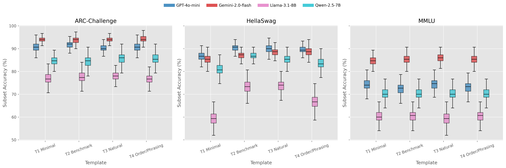
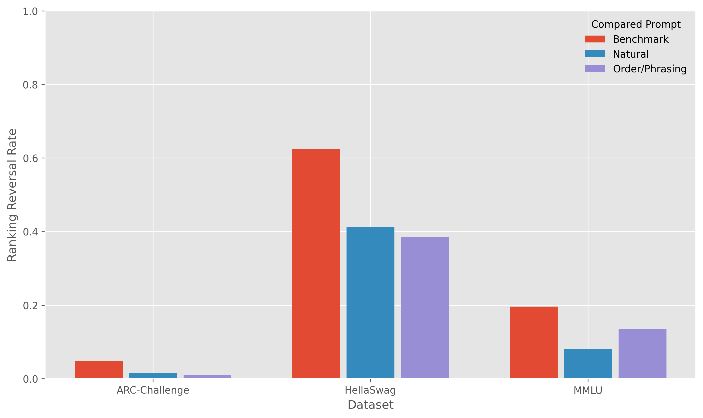

# Do LLM Rankings Change if You Ask Differently?
## Evaluating Ranking Reversals Under Non-semantic Prompt Perturbations and Subset Resampling

**ST5230 Group 14**  
ZHANG QIANCHI, PENG YANGYUNZHI, JIANG YIFAN, MENG XIANGCHEN

## Abstract

Static leaderboards implicitly assume that model rankings are stable under reasonable evaluation choices. We test this assumption by studying whether non-semantic prompt perturbations and evaluation-subset variation can alter model rankings on three multiple-choice benchmarks: MMLU, ARC-Challenge, and HellaSwag. We build a controlled evaluation set of 900 questions, expand it into 3,600 prompt requests using four task-preserving prompt templates, and collect 14,400 responses from GPT-4o-mini, Gemini-2.0-flash, Qwen-2.5-7B, and Llama-3.1-8B. We score all outputs automatically and use 2,000 bootstrap resamples per dataset to estimate confidence intervals, pairwise significance, rank probabilities, and ranking reversal rate (RRR). The main finding is that ranking stability is highly benchmark-dependent. ARC-Challenge is very stable, MMLU is moderately stable with uncertainty concentrated in middle ranks, and HellaSwag is substantially less stable, with prompt-induced ranking reversals reaching 62.55% under one prompt variant. These results suggest that leaderboard interpretation should distinguish average accuracy from ranking robustness, and that single-prompt, single-split evaluation can overstate the certainty of model ordering.

## 1. Introduction

Large language model evaluation is commonly presented as a leaderboard. Models are assigned benchmark scores, sorted by accuracy, and then treated as if the resulting order were a stable description of comparative ability. This convention is practical, but it embeds a strong assumption: small evaluation choices should not materially change the ordering between models.

That assumption is not obviously warranted. Even when the underlying task remains fixed, prompt phrasing, answer formatting, and instruction order may affect model behavior. Likewise, any reported score depends on the specific subset of items used in evaluation. If the gap between two models is small, then prompt noise or sample-composition noise may be large enough to change the apparent ranking.

This report studies leaderboard reliability through the lens of **ranking stability** rather than score variance alone. We ask not only whether prompt perturbations change accuracy, but whether they change the **relative ordering** between models. To answer this question, we combine prompt variation with bootstrap resampling and analyze ranking reversal rate, confidence intervals, pairwise significance, and subject-level instability.

Our contributions are threefold:

1. We evaluate ranking stability under four task-preserving prompt templates rather than a single benchmark prompt.
2. We combine prompt perturbation with bootstrap subset resampling, capturing both prompt noise and sample-composition noise.
3. We show that ranking robustness differs sharply across benchmarks: ARC-Challenge is stable, MMLU is partially stable, and HellaSwag is substantially unstable.

The broader implication is straightforward: a leaderboard should not be interpreted as fixed truth unless its ordering has been stress-tested against reasonable evaluation variation.

## 2. Related Work

Our study is connected to three threads of prior work.

First, benchmark construction papers such as MMLU, ARC, and HellaSwag established the evaluation settings that we use in this project and highlighted different forms of knowledge, reasoning, and commonsense difficulty (Hendrycks et al., 2020; Clark et al., 2018; Zellers et al., 2019).

Second, prompt-robustness research has shown that large language models can be sensitive to prompt variation, including perturbations that preserve task semantics. PromptRobust, for example, studies robustness under adversarial prompt changes and shows that prompt design can materially affect downstream performance (Zhu et al., 2023).

Third, recent reliability discussions in LLM evaluation have emphasized that an evaluation result is not only a property of the model, but also of the protocol used to measure it. Our project extends that perspective by focusing specifically on whether variation is large enough to change **rank order**, which is often the quantity practitioners care about most.

## 3. Task Formulation

Let a model be denoted by m, a prompt template by p, and a benchmark dataset by D. For each dataset, we estimate model performance under multiple prompt templates and repeated bootstrap resamples of the evaluation items.

We study three questions:

1. Do non-semantic prompt changes alter model accuracy?
2. How uncertain are those accuracies under evaluation-subset variation?
3. Are the resulting changes large enough to alter the ranking between models?

The core object of interest is therefore not only point accuracy, but the distribution of rankings induced by prompt and subset perturbations.

## 4. Experimental Design

### 4.1 Benchmarks and Sampling

We evaluate three automatically scorable multiple-choice benchmarks:

- **MMLU**: 300 questions, sampled as 50 questions from each of 6 subjects: `formal_logic`, `high_school_macroeconomics`, `college_medicine`, `high_school_physics`, `philosophy`, and `international_law`.
- **ARC-Challenge**: 300 questions from the official test split.
- **HellaSwag**: 300 questions from the validation split, because the public test split does not expose gold labels.

This yields a master sample of **900 questions**.

### 4.2 Prompt Templates

Each question is transformed into four task-preserving prompt templates:

- `minimal_instruction`
- `benchmark_style`
- `natural_style`
- `order_phrasing_variation`

These templates preserve the same task and answer options while varying tone, presentation, and instruction order. Expanding 900 questions by 4 templates produces **3,600 prompt requests**.

### 4.3 Models

We evaluate four models:

- `openai/gpt-4o-mini`
- `google/gemini-2.0-flash-001`
- `qwen/qwen-2.5-7b-instruct`
- `meta-llama/llama-3.1-8b-instruct`

Applying these models to 3,600 prompt requests produces **14,400 responses**.

### 4.4 Inference and Scoring

All responses are generated through OpenRouter with:

- `temperature = 0`
- `max_tokens = 150`

Outputs are parsed automatically into one of `A/B/C/D`, then compared with the gold label to yield a binary score. Out of 14,400 responses, only **3 parse failures** occur, representing **0.02%** of all outputs. All three failures come from Llama safety refusals, so they have negligible effect on aggregate conclusions.

### 4.5 Bootstrap Analysis

For each dataset, we run **2,000 bootstrap iterations**. In each iteration, we sample items with replacement from the dataset and recompute:

- prompt-specific accuracy
- prompt-averaged accuracy
- pairwise model differences
- rankings under each prompt template

We use the 2.5th and 97.5th percentiles of the bootstrap distribution to form 95% confidence intervals.

### 4.6 Ranking Reversal Rate

We take `minimal_instruction` as the baseline prompt. In each bootstrap iteration, we compare the model ranking under each alternative prompt with the ranking under the baseline prompt. If the order differs at any position, that iteration counts as a ranking reversal. The **Ranking Reversal Rate (RRR)** is the proportion of iterations with a changed ranking.

## 5. Main Results

### 5.1 Prompt-averaged Accuracy

Table 1 reports prompt-averaged accuracy and 95% confidence intervals.

| Dataset | Model | Accuracy | 95% CI | Rank |
| --- | --- | ---: | --- | ---: |
| ARC-Challenge | Gemini-2.0-flash | 94.00% | [91.42, 96.50] | 1 |
| ARC-Challenge | GPT-4o-mini | 90.83% | [87.58, 93.75] | 2 |
| ARC-Challenge | Qwen-2.5-7B | 85.08% | [81.17, 88.92] | 3 |
| ARC-Challenge | Llama-3.1-8B | 77.33% | [73.25, 82.00] | 4 |
| HellaSwag | GPT-4o-mini | 89.17% | [86.00, 92.09] | 1 |
| HellaSwag | Gemini-2.0-flash | 87.25% | [84.08, 90.25] | 2 |
| HellaSwag | Qwen-2.5-7B | 84.25% | [80.83, 87.75] | 3 |
| HellaSwag | Llama-3.1-8B | 68.33% | [63.92, 72.75] | 4 |
| MMLU | Gemini-2.0-flash | 85.08% | [81.17, 88.58] | 1 |
| MMLU | GPT-4o-mini | 73.42% | [68.67, 78.17] | 2 |
| MMLU | Qwen-2.5-7B | 70.33% | [65.58, 75.17] | 3 |
| MMLU | Llama-3.1-8B | 60.08% | [55.08, 65.25] | 4 |

At the point-estimate level, Gemini leads on ARC-Challenge and MMLU, while GPT-4o-mini leads on HellaSwag. However, the stability of these rank claims differs substantially by benchmark.

### 5.2 Ranking Reversal Rate

Table 2 reports RRR relative to the minimal prompt.

| Dataset | Benchmark | Natural | Order/Phrasing |
| --- | ---: | ---: | ---: |
| ARC-Challenge | 4.70% | 1.65% | 1.05% |
| HellaSwag | 62.55% | 41.35% | 38.50% |
| MMLU | 19.60% | 8.05% | 13.50% |

The result is not a small uniform effect. ARC-Challenge is highly stable. MMLU is moderately stable. HellaSwag is markedly unstable, with reversals in more than 60% of bootstrap iterations under the benchmark-style prompt.

### 5.3 Pairwise Significance

Pairwise bootstrap analysis shows where uncertainty is concentrated:

- **ARC-Challenge**: every pairwise comparison is significant at the 95% level. This matches the very low RRR.
- **HellaSwag**: GPT-4o-mini exceeds Gemini by only **1.92%**, with 95% CI **[-0.67, 4.75]** and **p = 0.169**. The top two models are therefore not significantly separated.
- **HellaSwag**: Gemini exceeds Qwen by **3.00%**, with 95% CI **[-0.58, 6.42]** and **p = 0.102**, indicating uncertainty even in the middle of the ranking.
- **MMLU**: Gemini exceeds GPT by **11.67%**, with 95% CI **[6.99, 16.08]**, clearly significant.
- **MMLU**: GPT exceeds Qwen by only **3.08%**, with 95% CI **[-1.50, 7.58]** and **p = 0.184**, so second and third place are not significantly separated.

These results show that ranking instability is most likely when performance gaps are narrow.

## 6. Dataset-wise Analysis

### 6.1 ARC-Challenge: Stable Leaderboard

ARC-Challenge is the most stable benchmark in the study. Gemini remains first under all prompt variants, and all pairwise gaps are significant. The low RRR values imply that prompt perturbation and subset resampling are too weak to overturn the ranking.

Under our experimental setting, ARC-Challenge behaves like a wide-margin benchmark. The leaderboard is therefore a reasonably reliable summary of comparative performance.

### 6.2 HellaSwag: Fragile Top Rank

HellaSwag is the clearest counterexample to the assumption that static leaderboards are robust. GPT-4o-mini has the highest point estimate, but its lead over Gemini is not statistically significant. At the same time, HellaSwag shows the highest RRR under every non-baseline prompt.

This means that the top rank on HellaSwag is not robust. In particular, the benchmark-style prompt produces a 62.55% reversal rate relative to the minimal prompt. A single leaderboard built from a single prompt is therefore an unreliable summary of model ordering on this task.

### 6.3 MMLU: Stable Winner, Unstable Middle

MMLU presents a mixed pattern. Gemini is clearly first and remains first across prompts. However, GPT-4o-mini and Qwen are not significantly separated, so the middle of the ranking is not fully settled.

This distinction matters. A benchmark can have a stable winner while still leaving uncertainty in non-top positions. Reporting only the first-place model would miss that structural instability.

## 7. Subject-level MMLU Analysis

We further run a subject-aware bootstrap analysis for MMLU.

First, pooled and stratified full-MMLU bootstrap produce the same overall order:

- Gemini-2.0-flash > GPT-4o-mini > Qwen-2.5-7B > Llama-3.1-8B

This indicates that the overall MMLU result is not an artifact of ignoring subject composition.

Second, subject-level instability varies dramatically. The mean RRR across non-minimal prompts is:

- philosophy: 67.93%
- high_school_physics: 62.25%
- college_medicine: 51.55%
- international_law: 45.48%
- formal_logic: 37.82%
- high_school_macroeconomics: 14.50%

So even within a benchmark that appears only moderately unstable overall, some subject slices are highly unstable. Ranking robustness is therefore not only benchmark-dependent, but also subdomain-dependent.

## 8. Discussion

Our findings support three claims.

First, prompt sensitivity should not be reduced to score fluctuation alone. On some tasks, the fluctuation is large enough to alter relative ranking, which is the more decision-relevant quantity.

Second, single-prompt evaluation can be misleading. On HellaSwag in particular, the apparent top model changes from ?plausibly best? to ?statistically unresolved? once prompt and subset variation are taken seriously.

Third, confidence intervals on accuracy are necessary but insufficient. What matters in model comparison is often whether order is robust, not only whether scores differ in expectation. RRR and rank-probability summaries make this visible.

## 9. Limitations

This study has several limitations.

First, we evaluate only three multiple-choice benchmarks, so the conclusions should not be generalized to all LLM tasks.

Second, we study only four models. A larger model set could reveal more complex rank structures.

Third, our prompt perturbations are intentionally shallow and task-preserving. They capture a narrow but important slice of evaluation variation rather than the full space of prompt design choices.

Fourth, the checked-in full Phase 2 results were historically produced from the notebook workflow and only later aligned to the standardized script. The repository is now standardized, but the historical provenance should still be acknowledged.

## 10. Conclusion

This report asks whether LLM rankings change if we ask differently. The answer is yes, but not uniformly.

ARC-Challenge yields a highly stable leaderboard. MMLU has a stable winner but unstable middle ranks. HellaSwag is substantially more sensitive to both prompt and subset variation, and its apparent winner is not significantly separated from the runner-up.

The main takeaway is that benchmark scores should not automatically be interpreted as stable model rankings. A more reliable evaluation practice should report not only who appears best on average, but also how robust that ordering is to prompt and sample variation.

## References

- Clark, P., Cowhey, I., Etzioni, O., Khot, T., Sabharwal, A., Schoenick, C., and Tafjord, O. 2018. *Think You Have Solved Question Answering? Try ARC, the AI2 Reasoning Challenge.*
- Hendrycks, D., Burns, C., Basart, S., Zou, A., Mazeika, M., Song, D., and Steinhardt, J. 2020. *Measuring Massive Multitask Language Understanding.*
- Zellers, R., Holtzman, A., Bisk, Y., Farhadi, A., and Choi, Y. 2019. *HellaSwag: Can a Machine Really Finish Your Sentence?*
- Zhu, K., Wang, J., Zhou, J., Wang, Z., Chen, H., Wang, Y., Yang, L., Ye, W., Gong, N. Z., Zhang, Y., and Xie, X. 2023. *PromptRobust: Towards Evaluating the Robustness of Large Language Models on Adversarial Prompts.*

## Appendix A. Reproducibility Notes

- Unified entrypoint: `run_pipeline.py`
- Phase 1: `src/01_data_prep.py`
- Phase 2: `src/02_api_runner.py`
- Phase 3: `src/03_scorer.py`
- Phase 4: `src/04_analysis.py`, `src/04_mmlu_subject_bootstrap.py`
- Main tables: `data/04_analysis/`
- Main figures: `plots/`

## Appendix B. Figures

### B.1 Bootstrap Accuracy Boxplots

### B.2 Ranking Reversal Rate

